# Welcome to Conversity.ai


## How can I edit this code?

There are several ways of editing your application.

The only requirement is having Node.js & npm installed - [install with nvm](https://github.com/nvm-sh/nvm#installing-and-updating)

Follow these steps:

```sh
# Step 1: Clone the repository using the project's Git URL.
git clone <YOUR_GIT_URL>

# Step 2: Navigate to the project directory.
cd <YOUR_PROJECT_NAME>

# Step 3: Install the necessary dependencies.
npm i

# Step 4: Start the development server with auto-reloading and an instant preview.
npm run dev
```

**Edit a file directly in GitHub**

- Navigate to the desired file(s).
- Click the "Edit" button (pencil icon) at the top right of the file view.
- Make your changes and commit the changes.

**Use GitHub Codespaces**

- Navigate to the main page of your repository.
- Click on the "Code" button (green button) near the top right.
- Select the "Codespaces" tab.
- Click on "New codespace" to launch a new Codespace environment.
- Edit files directly within the Codespace and commit and push your changes once you're done.

## Project Structure

This project follows a modern React application structure with TypeScript and Vite. Here's an overview of the architecture:

```mermaid
graph TD
    A[📁 ad-chat-advisor] --> B[📁 src]
    A --> C[📁 public]
    A --> D[📁 assets]
    A --> E[⚙️ Config Files]
    
    B --> F[📄 main.tsx - Entry Point]
    B --> G[📄 App.tsx - Router & Providers]
    B --> H[📁 pages]
    B --> I[📁 components]
    B --> J[📁 hooks]
    B --> K[📁 lib]
    B --> L[📁 stores]
    
    H --> H1[📄 Index.tsx - Home Page]
    H --> H2[📄 Ads.tsx - Solutions Page]
    H --> H3[📄 Chat.tsx - Chat Interface]
    H --> H4[📄 NotFound.tsx - 404 Page]
    
    I --> I1[📁 ui - shadcn Components]
    I --> I2[📄 ChatSidebar.tsx]
    I --> I3[📄 ChatWindow.tsx]
    I --> I4[📄 FileUpload.tsx]
    I --> I5[📄 ProductRecommendation.tsx]
    I --> I6[📄 SolutionCreator.tsx]
    I --> I7[📄 VendorTypeSelector.tsx]
    I --> I8[📄 ... more components]
    
    I1 --> UI1[📄 button.tsx]
    I1 --> UI2[📄 dialog.tsx]
    I1 --> UI3[📄 card.tsx]
    I1 --> UI4[📄 input.tsx]
    I1 --> UI5[📄 ... 40+ UI components]
    
    J --> J1[📄 use-mobile.tsx]
    J --> J2[📄 use-toast.ts]
    
    K --> K1[📄 utils.ts - Helper Functions]
    
    L --> L1[📄 chatStore.ts - Chat State]
    L --> L2[📄 vendorStore.ts - Vendor State]
    
    C --> C1[📄 favicon.ico]
    C --> C2[📄 placeholder.svg]
    C --> C3[📄 robots.txt]
    
    D --> D1[📄 logo.jpeg]
    
    E --> E1[📄 package.json]
    E --> E2[📄 vite.config.ts]
    E --> E3[📄 tailwind.config.ts]
    E --> E4[📄 tsconfig.json]
    E --> E5[📄 eslint.config.js]
    
    style A fill:#e1f5fe
    style B fill:#f3e5f5
    style I fill:#e8f5e8
    style I1 fill:#fff3e0
    style L fill:#fce4ec
    style H fill:#f1f8e9
```



### Key Architecture Features:

- **🏗️ Modular Component Architecture**: Organized into reusable components with a dedicated UI component library
- **📱 Responsive Design**: Built with Tailwind CSS and responsive utilities
- **🔄 State Management**: Zustand stores for chat and vendor state management
- **🛣️ Client-Side Routing**: React Router for navigation between pages
- **⚡ Fast Development**: Vite for lightning-fast builds and hot module replacement
- **🎨 Modern UI**: shadcn-ui component library with 40+ pre-built components
- **📊 Data Fetching**: TanStack Query for efficient data management
- **🔧 Type Safety**: Full TypeScript support throughout the application

## What technologies are used for this project?

This project is built with:

- **⚡ Vite** - Fast build tool and development server
- **📘 TypeScript** - Type-safe JavaScript with enhanced developer experience
- **⚛️ React** - Modern UI library with hooks and functional components
- **🎨 shadcn-ui** - Beautiful, accessible component library built on Radix UI
- **🎭 Tailwind CSS** - Utility-first CSS framework for rapid styling
- **🛣️ React Router** - Client-side routing for single-page application
- **🐻 Zustand** - Lightweight state management solution
- **📊 TanStack Query** - Powerful data fetching and caching library
- **🎯 Radix UI** - Low-level UI primitives for accessibility and customization
